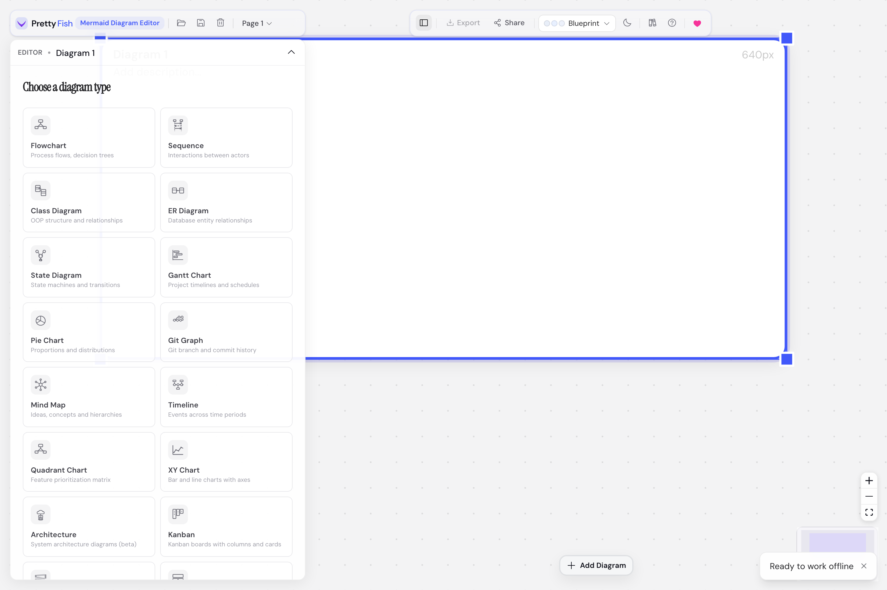
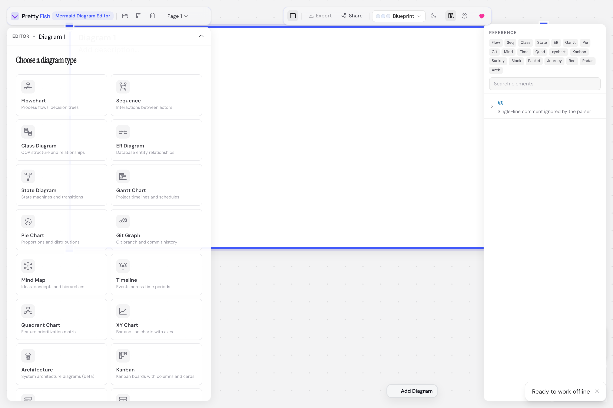
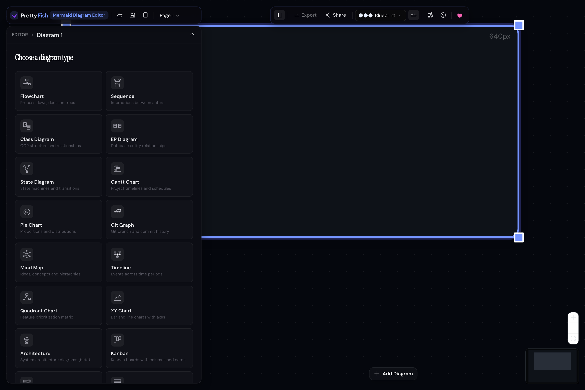

# Pretty Fish

Pretty Fish is a browser-based Mermaid workspace for writing, arranging, and sharing diagrams without leaving the browser.

It is built for a workflow that sits somewhere between a text editor and a diagram board: edit Mermaid source, preview the result immediately, keep multiple diagrams on a canvas, and organize work across pages.

## Screenshots







## What It Does

- Write Mermaid diagrams with a live preview.
- Arrange multiple diagrams on an infinite canvas.
- Group diagrams into multi-page projects.
- Tune appearance with built-in themes and diagram settings.
- Export diagrams as SVG, PNG, or Mermaid source.
- Share diagrams through URL-encoded state.
- Run as a PWA with offline support.

## Why This README Is Short

This project changes quickly. The README aims to stay useful over time, so it focuses on the product, the development workflow, and the major architectural ideas instead of mirroring every file or every feature toggle in the codebase.

For contributor-specific guidance, see [CONTRIBUTING.md](CONTRIBUTING.md).

## Getting Started

### Requirements

- Node.js 20+
- npm 10+

### Install

```bash
npm install
```

### Run locally

```bash
npm run dev
```

### Optional analytics configuration

If you want PostHog enabled during development, create `.env.local` from `.env.example`:

```env
VITE_POSTHOG_KEY=your_posthog_project_api_key
VITE_POSTHOG_HOST=https://us.i.posthog.com
```

If `VITE_POSTHOG_KEY` is not set, analytics stay off.

## Common Commands

```bash
npm run dev        # Vite dev server
npm run typecheck  # TypeScript project check
npm run lint       # ESLint + dark-mode audit
npm test           # Vitest
npm run e2e        # Playwright, including Axe accessibility checks
npm run build      # Production build
npm run preview    # Local Wrangler preview of the production build
npm run deploy     # Deploy to Cloudflare
```

## Architecture

Pretty Fish is a client-heavy React application with a few clear layers:

- UI components for the editor, canvas, docs panel, export flows, and presentation mode
- hooks that coordinate state, persistence, history, rendering, and keyboard behavior
- a reducer-driven app store for document and UI state
- Mermaid rendering, project serialization, sharing, and reference data under `src/lib`

The app is designed so most product behavior lives in typed state and small utility modules rather than inside large unstructured components.

## Deployment

The project is set up for Cloudflare via Wrangler. Build output is generated with Vite and the app can be deployed with:

```bash
npm run deploy
```

Cloudflare configuration lives in [wrangler.jsonc](wrangler.jsonc).

## Contributing

Contributions are welcome. Start with [CONTRIBUTING.md](CONTRIBUTING.md).

## License

Licensed under Apache License 2.0. See [LICENSE](LICENSE).
